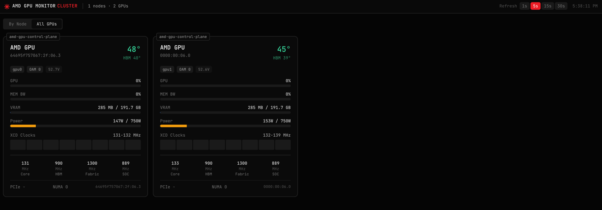
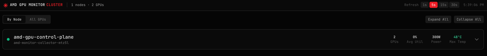

# AMD GPU Monitor

A lightweight monitoring tool for AMD Instinct GPUs (MI300X and similar) with a web dashboard and Prometheus metrics. Supports both single-node and multi-node Kubernetes cluster deployments.

## Screenshots

### Cluster View - All GPUs


### Cluster View - By Node


## Features

- Real-time GPU monitoring with web dashboard
- Per-XCD clock visualization (for MI300X with 8 compute dies)
- Memory bandwidth utilization tracking
- ECC error monitoring
- Prometheus metrics endpoint
- **Single-node mode**: Run on individual machines
- **Cluster mode**: Aggregate metrics from all nodes in a Kubernetes cluster

## Architecture

### Single-Node Mode

Run the collector directly on a machine with AMD GPUs:

```
┌─────────────────────────────────────┐
│           Single Node               │
│  ┌─────────────────────────────┐   │
│  │  amd-monitor (collector)    │   │
│  │  - Collects local GPU data  │   │
│  │  - Serves web dashboard     │   │
│  │  - Exposes /metrics         │   │
│  └──────────────┬──────────────┘   │
│                 │                   │
│  ┌──────────────▼──────────────┐   │
│  │      AMD GPUs (MI300X)      │   │
│  └─────────────────────────────┘   │
└─────────────────────────────────────┘
```

### Multi-Node Cluster Mode

For Kubernetes clusters with multiple GPU nodes:

```
┌─────────────────────────────────────────────────────────────────────┐
│                         Kubernetes Cluster                           │
│                                                                      │
│  ┌───────────────────────────────────────────────────────────────┐  │
│  │                    Aggregator (Deployment)                     │  │
│  │  ┌─────────────────────────────────────────────────────────┐  │  │
│  │  │  amd-aggregator                                         │  │  │
│  │  │  - Discovers collector pods via K8s API                 │  │  │
│  │  │  - Pulls metrics from all collectors                    │  │  │
│  │  │  - Serves unified cluster dashboard                     │  │  │
│  │  └─────────────────────────────────────────────────────────┘  │  │
│  └───────────────────────────────────────────────────────────────┘  │
│                               │                                      │
│                     fetches from all nodes                           │
│                               ▼                                      │
│  ┌──────────────────┐  ┌──────────────────┐  ┌──────────────────┐   │
│  │     Node 1       │  │     Node 2       │  │     Node N       │   │
│  │  ┌────────────┐  │  │  ┌────────────┐  │  │  ┌────────────┐  │   │
│  │  │ Collector  │  │  │  │ Collector  │  │  │  │ Collector  │  │   │
│  │  │ DaemonSet  │  │  │  │ DaemonSet  │  │  │  │ DaemonSet  │  │   │
│  │  └─────┬──────┘  │  │  └─────┬──────┘  │  │  └─────┬──────┘  │   │
│  │        │         │  │        │         │  │        │         │   │
│  │  ┌─────▼──────┐  │  │  ┌─────▼──────┐  │  │  ┌─────▼──────┐  │   │
│  │  │  AMD GPUs  │  │  │  │  AMD GPUs  │  │  │  │  AMD GPUs  │  │   │
│  │  └────────────┘  │  │  └────────────┘  │  │  └────────────┘  │   │
│  └──────────────────┘  └──────────────────┘  └──────────────────┘   │
└─────────────────────────────────────────────────────────────────────┘
```

## Docker Images

Container images are available on GitHub Container Registry (ghcr.io). See the releases page for available tags.

| Image | Description |
|-------|-------------|
| `ghcr.io/core-optimizer/amd-monitor` | Collector - runs on GPU nodes, collects metrics |
| `ghcr.io/core-optimizer/amd-aggregator` | Aggregator - central dashboard for cluster view |

## Quick Start

### Single Node (Docker)

```bash
# Run with GPU access
docker run --rm -it \
  --device=/dev/kfd \
  --device=/dev/dri \
  --privileged \
  -p 8080:8080 \
  ghcr.io/core-optimizer/amd-monitor:latest
```

Open http://localhost:8080 in your browser.

### Kubernetes Cluster

Deploy both the collector DaemonSet and aggregator:

```bash
# Deploy everything
kubectl apply -f deploy/daemonset.yaml
kubectl apply -f deploy/aggregator.yaml
```

Access the cluster dashboard:

```bash
# Port forward to aggregator
kubectl -n amd-monitor port-forward svc/amd-monitor 8080:8080

# Open http://localhost:8080
```

### Kubernetes Single-Node Access

You can also access individual collector pods directly:

```bash
# Port forward to a specific collector pod
kubectl -n amd-monitor port-forward pod/<collector-pod-name> 8080:8080
```

## Configuration

### Environment Variables

| Variable | Default | Description |
|----------|---------|-------------|
| `AMD_MONITOR_PORT` | `8080` | HTTP server port |
| `AMD_MONITOR_INTERVAL` | `5s` | Metrics collection interval |
| `AMD_MONITOR_LOG_LEVEL` | `info` | Log level (debug, info, warn, error) |

### Aggregator-specific Variables

| Variable | Default | Description |
|----------|---------|-------------|
| `COLLECTOR_ENDPOINTS` | (auto-discover) | Comma-separated list of collector endpoints (for non-K8s) |
| `POD_NAMESPACE` | `amd-monitor` | Namespace to discover collector pods |

## API Endpoints

### Collector Endpoints

| Endpoint | Description |
|----------|-------------|
| `GET /` | Web dashboard (single-node view) |
| `GET /api/v1/gpus` | All GPU metrics (JSON) |
| `GET /api/v1/gpus/{id}` | Single GPU metrics |
| `GET /api/v1/node` | Node information |
| `GET /api/v1/node/metrics` | Combined node + GPU metrics (for aggregator) |
| `GET /api/v1/health` | Health check |
| `GET /metrics` | Prometheus metrics |

### Aggregator Endpoints

| Endpoint | Description |
|----------|-------------|
| `GET /` | Web dashboard (cluster view) |
| `GET /api/v1/cluster` | All cluster metrics (JSON) |
| `GET /api/v1/cluster/gpus` | All GPUs across cluster |
| `GET /api/v1/nodes` | All nodes with their GPUs |
| `GET /api/v1/nodes/{node}` | Single node metrics |
| `GET /api/v1/health` | Health check |

## Dashboard Features

### Single-Node View
- GPU cards with real-time metrics
- Temperature (hotspot + HBM)
- VRAM usage
- Power draw
- GPU and memory bandwidth utilization
- XCD clocks visualization (8 bars for MI300X)
- Fabric/SOC clocks
- ECC error indicators
- Topology view

### Cluster View
- Node overview with summary stats
- Expandable nodes showing individual GPUs
- "All GPUs" flat view across cluster
- Total GPU/node counts
- Per-node health indicators

## Prometheus Metrics

All metrics include labels: `device`, `name`, `hostname`

| Metric | Type | Description |
|--------|------|-------------|
| `amd_gpu_temperature_celsius` | gauge | GPU hotspot temperature |
| `amd_gpu_memory_used_bytes` | gauge | VRAM used |
| `amd_gpu_memory_total_bytes` | gauge | VRAM total |
| `amd_gpu_utilization_percent` | gauge | GPU utilization (0-100) |
| `amd_gpu_power_draw_watts` | gauge | Current power draw |
| `amd_gpu_power_limit_watts` | gauge | Power limit |
| `amd_gpu_clock_core_mhz` | gauge | Core clock speed |
| `amd_gpu_clock_memory_mhz` | gauge | Memory clock speed |
| `amd_gpu_pcie_bandwidth_tx_gbps` | gauge | PCIe TX bandwidth |
| `amd_gpu_pcie_bandwidth_rx_gbps` | gauge | PCIe RX bandwidth |
| `amd_gpu_pcie_replay_count` | counter | PCIe replay errors |
| `amd_gpu_ras_errors_correctable` | counter | Correctable ECC errors |
| `amd_gpu_ras_errors_uncorrectable` | counter | Uncorrectable ECC errors |

### Prometheus Scrape Config

```yaml
scrape_configs:
  # Scrape individual collectors
  - job_name: 'amd-gpu-collectors'
    kubernetes_sd_configs:
      - role: pod
        namespaces:
          names: ['amd-monitor']
    relabel_configs:
      - source_labels: [__meta_kubernetes_pod_label_component]
        regex: collector
        action: keep
      - source_labels: [__meta_kubernetes_pod_ip]
        target_label: __address__
        replacement: '${1}:8080'
```

## Troubleshooting

### No GPUs detected

1. Ensure AMD GPU drivers are installed
2. Check if `amd-smi` works: `amd-smi list`
3. Verify device access: `ls -la /dev/dri /dev/kfd`

### Aggregator not discovering collectors

1. Check RBAC permissions: `kubectl auth can-i list pods -n amd-monitor --as=system:serviceaccount:amd-monitor:amd-monitor-aggregator`
2. Verify collector pods are running: `kubectl get pods -n amd-monitor -l component=collector`
3. Check aggregator logs: `kubectl logs -n amd-monitor -l component=aggregator`

### N/A values in metrics

Some metrics may show as N/A depending on GPU model and driver version. The collector handles these gracefully and displays available data.

## License

Attribution-NonCommercial Software License (ANCSL) v1.0 - See [LICENSE.txt](LICENSE.txt)
